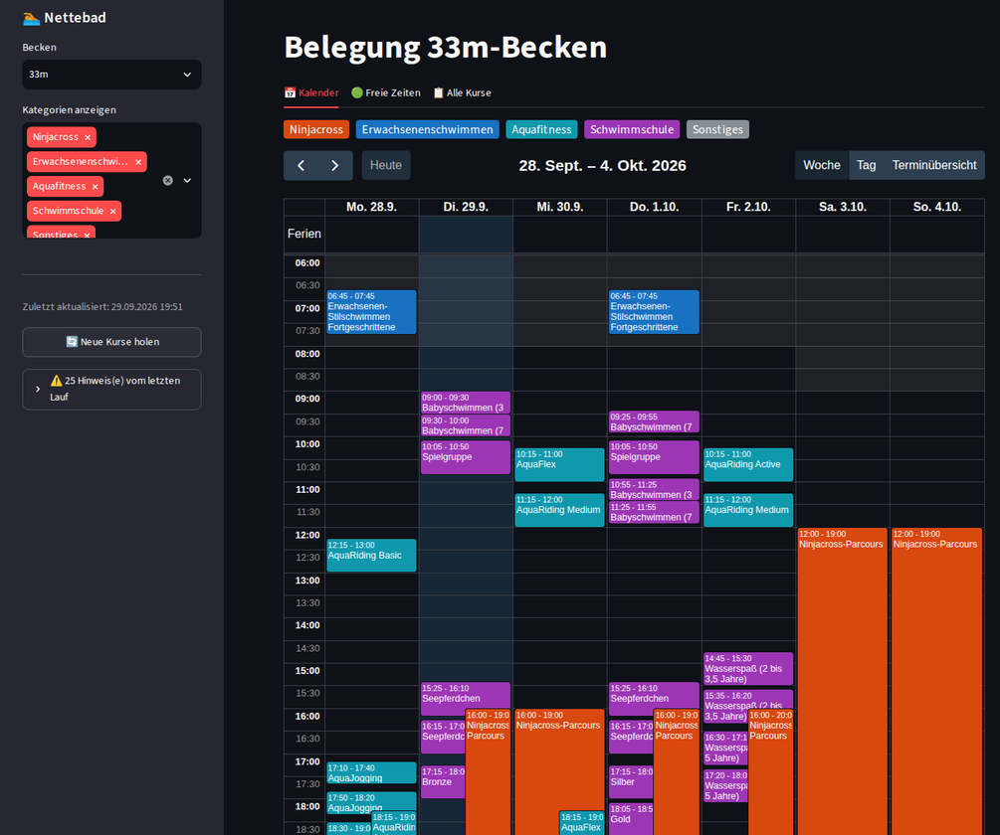
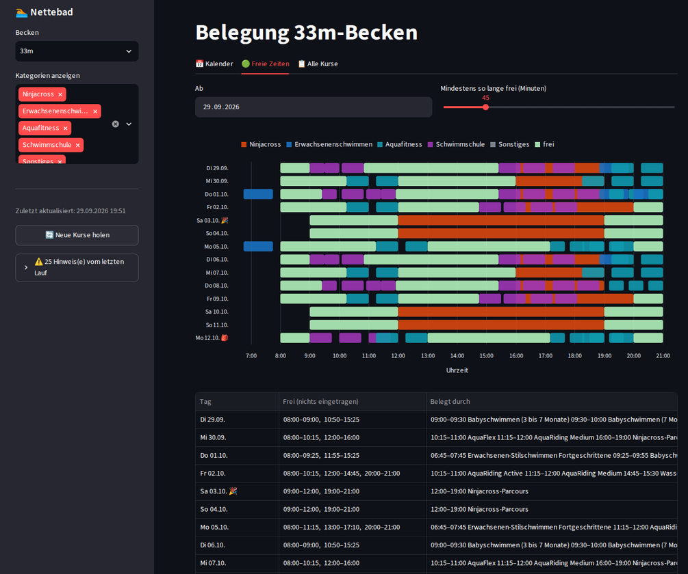

# Nettebad & Moskaubad Osnabrück – Belegung der Schwimmbecken

Wann kann man im [Nettebad](https://www.stadtwerke-osnabrueck.de/nettebad) in Ruhe seine Bahnen ziehen?
Das 33-Meter-Becken in der Erlebniswelt ist oft durch Kurse oder den Ninjacross-Parcours belegt.
Diese App sammelt alle Belegungen an einem Ort und zeigt, wann das Becken frei ist.
Zusätzlich lässt sich das Hallenbad im [Moskaubad](https://www.stadtwerke-osnabrueck.de/moskaubad) auswählen.

> **Inoffizielles Privatprojekt.** Nicht mit den Stadtwerken Osnabrück, dem Nettebad oder dem Moskaubad verbunden.
> Alle Angaben ohne Gewähr – maßgeblich sind die offiziellen Seiten des Bads und des Buchungsportals.

| Kalender | Freie Zeiten |
|---|---|
|  |  |

## Was die App zeigt

### 📅 Kalender
Eine Wochenansicht aller Belegungen des gewählten Beckens (33-Meter-Becken im Nettebad oder Moskaubad),
farbig nach Art:

- **Ninjacross-Parcours** (nur Nettebad) – inklusive der abweichenden Zeiten in den Schulferien und an Feiertagen
- **Schwimmschule** – Babyschwimmen, Seepferdchen, Bronze/Silber/Gold, Ferienkurse …
- **Aquafitness** – AquaJogging, AquaFlex, AquaRiding …
- **Erwachsenenschwimmen** – Anfänger- und Stilschwimmkurse

Grau hinterlegt sind die Zeiten, in denen das Becken geschlossen ist, gelb die Schulferien.
Ein Klick auf einen Kurs öffnet ihn im Buchungsportal. Auf dem Handy zeigt der Kalender einen Tag
(umschaltbar auf drei Tage oder eine Liste).

### 🟢 Freie Zeiten
Für die nächsten 14 Tage: eine Zeitleiste pro Tag und eine Liste der Zeitfenster, in denen weder ein Kurs
noch der Ninjacross-Parcours eingetragen ist. Die Mindestdauer eines freien Fensters ist einstellbar.

### 📋 Alle Kurse
Eine Übersicht aller erfassten Kursblöcke mit Zeitraum, Wochentagen, Uhrzeiten, Anzahl der Termine und
abgesagten Terminen.

### 🏷️ Becken zuordnen
Das Buchungsportal gibt nur das Bad an, nicht das Becken. Standardmäßig zählt deshalb jeder Nettebad-Kurs
zum 33-Meter-Becken und jeder Moskaubad-Kurs zum Moskaubad. Findet ein Kurs woanders statt (z. B. im
Lehrschwimmbecken), lässt er sich hier pro Bad per Dropdown umsortieren.

## Woher die Daten kommen

| Was | Quelle |
|---|---|
| Kurse und alle Einzeltermine | [Buchungsportal der SWO-Bäder](https://www.swo-baeder-buchungsportal.de/de/bookings/blocks/) |
| Ninjacross-Parcours, Öffnungszeiten Nettebad | [Öffnungszeiten Erlebniswelt](https://www.stadtwerke-osnabrueck.de/nettebad/oeffnungszeiten/erlebniswelt) |
| Öffnungszeiten Moskaubad (Hallenbad) | [Öffnungszeiten Hallenbad](https://www.stadtwerke-osnabrueck.de/moskaubad/oeffnungszeiten/hallenbad) |
| Schulferien Niedersachsen / NRW, Feiertage | Ferienkalender bzw. Paket [`holidays`](https://pypi.org/project/holidays/) |

Die Daten werden einmal täglich aktualisiert. Dabei bleiben auch Kurse erhalten, die nicht mehr im Portal
stehen (z. B. weil sie ausgebucht sind oder schon laufen), bis ihr letzter Termin vorbei ist.
Im Portal abgesagte Termine gelten als frei.

„Frei“ heißt nur: Es ist kein Kurs eingetragen. Andere Badegäste, Vereinstraining oder kurzfristige
Sperrungen kennt die App nicht.

## Technik

Python, [Streamlit](https://streamlit.io), SQLite und [FullCalendar](https://fullcalendar.io) (MIT-Lizenz).
